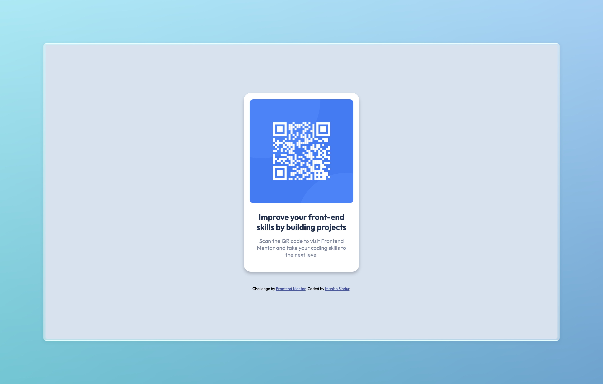
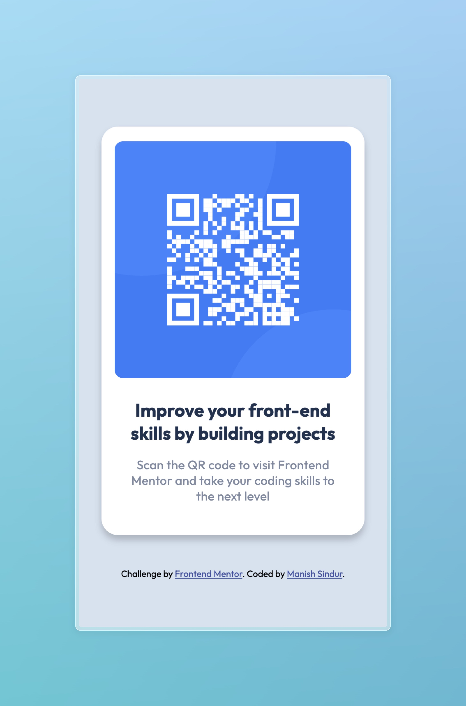

# Frontend Mentor - QR code component solution

This is a solution to the [QR code component challenge on Frontend Mentor](https://www.frontendmentor.io/challenges/qr-code-component-iux_sIO_H). Frontend Mentor challenges help you improve your coding skills by building realistic projects.

## Table of contents

- [Overview](#overview)
  - [Screenshot](#screenshot)
- [My process](#my-process)
  - [Built with](#built-with)
  - [What I learned](#what-i-learned)
  - [Useful resources](#useful-resources)
- [Author](#author)
- [Acknowledgments](#acknowledgments)

## Overview

### Screenshot

## My process

### Built with

- Vanilla CSS
- Flexbox

### What I learned

- Learned about the CSS reset.
- Flexbox.
- Utility Class.

### Useful resources

- [freeCodecamp](https://www.freecodecamp.org/) - Learned HTML, CSS, JS on the way and the best things is that they have test cases to check your solution whether it's right or not.
- [Odin Projects](https://www.theodinproject.com/) - This is a very well documented site, it teaches you to work on your local environment with the industry standard practices.

## Author

- Frontend Mentor - [@manishsindur](https://www.frontendmentor.io/profile/manishsindur)
- Twitter - [@manishsindur](https://twitter.com/manishsindur)
- LinkedIn - [@manishsindur](https://www.linkedin.com/in/manishsindur/)

## Acknowledgments

Thanks to [Kevin Powell](https://youtu.be/KqFAs5d3Yl8) YouTube Channel i got to know about Frontend Mentor.
